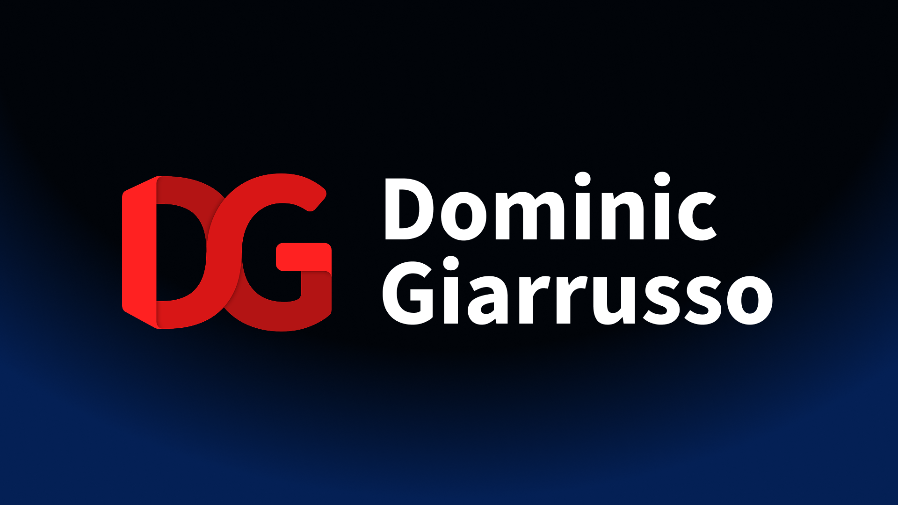

# Dominic Giarrusso's personal site

My personal site is a home for my projects, experience, and creative work. It
replaces an earlier portfolio built from a single HTML file with a component
and content structure that is easier to maintain as the site grows.

[Visit the site](https://dominicgiarrusso.com)



## About the project

Each project has a dedicated page backed by structured TypeScript data and MDX
content. Shared React components handle the layout, links, technology badges,
and media, so adding a project does not require copying an existing page.

The site includes:

- Responsive layouts with light and dark themes
- Project pages with image carousels and syntax-highlighted MDX content
- Art, photography, and video galleries with lightbox viewing
- A contact form protected by Cloudflare Turnstile
- Route-specific titles, descriptions, social metadata, and canonical URLs

## Stack

- TypeScript and React
- TanStack Start and TanStack Router
- Tailwind CSS and shadcn/ui
- Vite and MDX
- Yet Another React Lightbox
- Cloudflare Workers

## Project structure

```text
content/projects/     Project page copy written in MDX
public/               Images, icons, and other static assets
src/components/       Shared React components and UI primitives
src/content/          Typed project, gallery, video, and contact data
src/routes/           TanStack Router file-based routes
```

To add a project, define its metadata and media in
`src/content/projects.ts`, add its MDX body under `content/projects/`, and place
its local assets under `public/images/projects/`.
